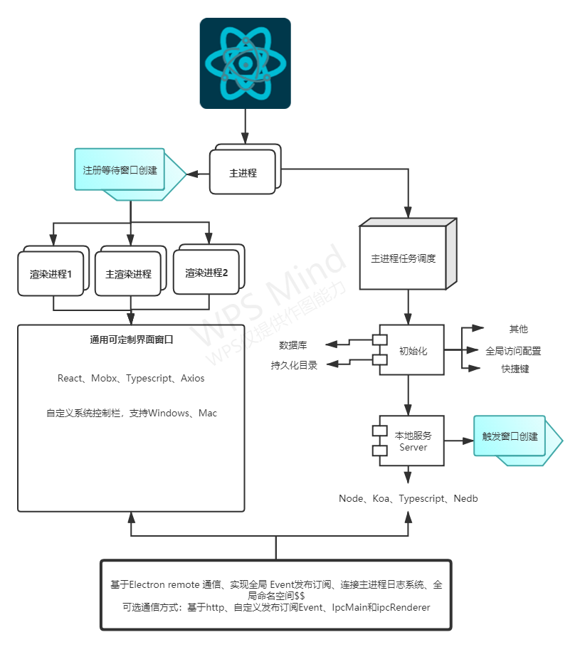

# @xeajs/electron

渐进式、沉浸式、高可用、可配置、模块化、语义化、一键开发，打包、快速开始。

## 系统架构

<span style="background: #f1f1f1;display: inline-block;">
  
</span>

## Install

```bash

git clone https://github.com/xeajs/electron

```

## 技术栈

``` js
/** 端支持 */
electron                  ==>   客户端运行时
electron-builder          ==>   客户端打包
nodemon                   ==>   编辑主进程自动重启

/** 服务端 - 运行于主进程 */
node                      ==>   server
koa
koa-bodyparser
koa-compress
koa-favicon
koa-router
koa-static
typescript
nedb                      ==>   Node嵌入式数据库、本地持久化、加密
  ...

/** 前端 - 运行于渲染进程 */
react                     ==>   client
react-dom
react-router
react-router-dom
mobx
mobx-react
mobx-react-router
history
fetch                     ==> 无需考虑兼容性，自定义封装fetch 欲达到axios一致的使用体验
axios                     ==>   ajax 请求工具
antd
typescript
moment             ==>   日期处理工具，antd 使用 dayjs，轻量级
  ...

/** 代码构建 */
webpack
babel
babel/preset-typescript   ==>   实现ts转js，没有静态类型检测，静态类型检测在 git 钩子

/** 开发体验 */
eslint                    ==>   可配置开关、开发环境运行时
tslint                    ==>   可配置开关、开发环境运行时、子进程基于 tsc -w
husky
lint-staged
prettier
/** end */

```

## 核心

```js
/** 基础 */
1. 启动 electron 软件提供运行时
2. 编译 前端 并通过 webpack 提供前端可访问服务
3. 通过 webpack 编译主进程代码输出到实体文件，提供 electron 主进程运行
4. 开发环境：electron启动 --> 加载主进程代码运行 --> 创建窗口 loadURL(http webpack server) --> 显示界面
5. 生产环境：electron启动 --> 加载主进程代码运行 --> 创建窗口 loadURL(http 主进程提供server) --> 显示界面

/** 开发时 yarn start */
1. 并行编译 a. 前端代码到webpack-dev-server 服务。 b. 主进程代码到实体文件 -- dist/serve/index.js
2. 收集两个webpack编译结果。两个都编译完成后启动 electron 加载编译好的主进程代码
3. 在主进程中创建窗口，窗口内容链接到 webpack 提供的服务地址
4. 完成启动
5. vscode 保存时自动 fix eslint。自动对 import 进行排序

/** 打包 yarn build */
1. 并行打包前端和主进程代码
2. 把打包好的js代码打包进 electron 项目内
3. 构建 exe 或者 app 软件包

/** git commit */
1. 基于 husky 注册了 git 钩子
2. 基于 lint-staged 获取 git add 到暂存区的文件
3. 检测暂存区的文件的 eslint
4. 全局检测 ts 文件代码的类型，不输出文件，只进行静态类型检测

```

## 提供的能力

```js

1. 常规前端开发的渲染进程开发体验，热更新，webpack编译速度优化。基于tsx。使用 typescript 编写 react 代码
2. 前端引入 mobx react的状态管理工具，更好的支持 typescript 类型，核心基于 es6 proxy编写
3. 前端基于 React.lazy 和 React.Suspense 实现路由懒加载。 弃用 react-loadable。因为在某些环境下报错日志会被混淆
4. 主进程代码基于 typescript 编写。更好的类型检测，提供 koa 编写寄生在主进程的 node 服务
5. 代码风格基于eslint的检测，配置 vscode 编辑器的项目配置。
6. 代码提交到仓库时检测。检测ts代码风格，检测ts静态类型。全部检测合法之后才允许提交代码到仓库， git --no-verify 等其他人为操作 只能人为规范
7. 一键式进入开发模式，一键打包。优化开发体验和交付体验
8. mock 数据直接使用主进程的 koa-router 构造提供，离线应用直接编写真实接口数据

```

## styled-jsx

* 模式 css in js
* 框架 styled-jsx
* vscode css 代码高亮插件 vscode-styled-jsx
* vscode css 代码提示插件 styled-jsx Language Server 1.0.1
* 注意事项, 样式输出报错， 大括号换行无法检测到样式
* @See: <https://github.com/Grimones/vscode-styled-jsx-languageserver/issues/2>

```jsx
/** 错误写法 */
<style jsx>
  {`
      .app-style {
        display: flex;
        justify-content: center;
        align-items: center;
        background-color: #fff;
      }
  `}
</style>
```

``` jsx
/** 正确写法 */
 <style jsx>{`
    .app-style {
      display: flex;
      justify-content: center;
      align-items: center;
      background-color: #fff;
    }
`}</style>

```

## TODO

1. 【done】 热更 `基于 react-refresh 实现热替换，保留react状态`
1. 【done】 设置页用户信息持久化 配置文件 `settings.json` 或者 options.json 或者 electron IndexedDB 或 Web SQL
1. 【done】全局 namespace；Xea | Root | `$$` | 其他。保存如，软件外部存储目录，日志目录，等等
1. 【done】webpack css 编译支持 Sass，Stylus，postcss， `less`， `styled-jsx`

## 写在最后

1. 欢迎交流
1. 欢迎体验
1. 欢迎 Issues
1. 感谢 Star
1. 联系作者  [webhref.com](https://www.webhref.com/)
